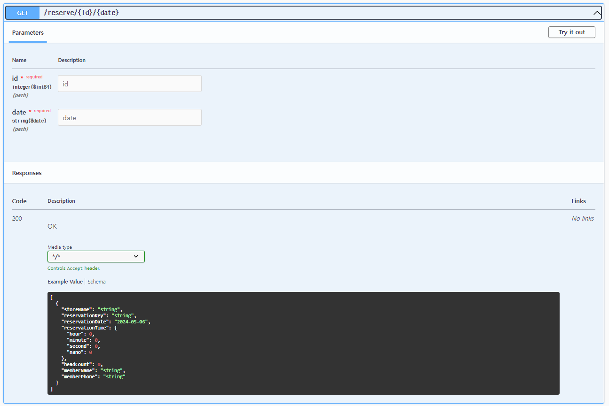
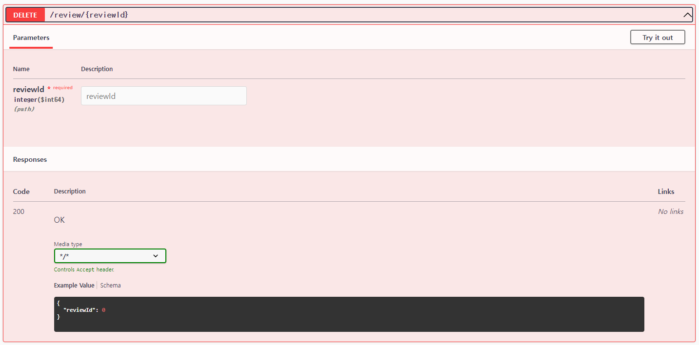

# 매장 예약 서비스 프로젝트

## 구현 목록
- **공통 인증** : CUSTOMER/MANAGER
- **MANAGER**
  - 매장 등록
  - 매장 정보 수정
  - 매장 삭제
  - 리뷰 삭제
- **CUSTOMER**
  - 예약 진행
  - 도착 확인
  - 리뷰 작성
  - 리뷰 수정
  - 리뷰 삭제
 
## 개발 환경
- Java 17
- Spring boot 3.2.5
- Gradle
- Spring data JPA
- Spring Security
- Spring validation
- MariaDB

## 외부 라이브러리
- io.jsonwebtoken:jjwt-api:0.11.5 : JWT 발행 기능을 제공해주는 라이브러리
- Lombok : Model 클래스나 Entity 같은 도메인 클래스 등에 반복되는 getter, setter 등의 메소드를 자동으로 만들어주는 라이브러리
- Swagger : 개발한 Rest API를 문서화해주는 라이브러리, 문서화된 내용을 통해 관리 & API 호출을 통한 테스트를 가능케 함

## ERD

## Swagger

### member-controller

#### POST : /member/signup

- 회원 가입 api
- Request
  - Body : name, email, password, phone, role
- Response
  - memberKey, name, email, role

#### POST : /member/signin

- 로그인 api
- Request
  - Body : email, password
- Response
  - Header : Authorization
  - memberKey, name, email, role

### store-controller

#### POST : /store/registration

- 매장 등록 api
- Request
  - Header : Authorization (MANAGER)
  - Body : memberKey, storeName, address, description, phone
- Response
  - storeKey, storeName

#### PATCH : /store

- 매장 정보 수정 api
- Request
  - Header : Authorization (MANAGER)
  - Body : storeKey, storeName, address, description, phone
- Response
  - storeKey, storeName, address, description, phone

#### GET : /store/{storeKey}

- 매장 상세 정보 조회 api
- Request
  - Header : Authorization (MANAGER/CUSTOMER)
  - Path : storeKey
- Response
  - storeKey, name, address, description, phone

#### DELETE : /store/{storeKey}

- 매장 삭제 api
- Request
  - Header : Authorization (MANAGER)
  - Path : storeKey
- Response
  - storeKey

#### GET : /store/sortedlist

- 매장 전체 조회 api (가나다순)
- Request
  - Header : Authorization (MANAGER/CUSTOMER)
- Response
  - List of storeName, address

#### GET : /store/search

- 매장 검색 api (자동 완성)
- Request
  - Header : Authorization (MANAGER/CUSTOMER)
  - Param : keyword
- Response
  - List of storeName

### reservation-controller

#### POST : /reserve

- 예약 진행 api
- Request
  - Header : Authorization (CUSTOMER)
  - Body : memberKey, storeName, address, description, phone(of member)
- Response
  - storeKey, storeName 

#### PATCH : /reserve/visit

- 방문 확인 api
- Request
  - Header : Authorization (CUSTOMER)
  - Body : memberKey, storeName, address, description, phone(of member)
- Response
  - reservationKey

#### GET : /reserve/{id}/{date}

- 날짜별 예약 정보
- Request
  - Header : Authorization (MANAGER/CUSTOMER)
  - Path : id(of store), date(of reservation)
- Response
  - Body : List of storeName, reservationKey, reservationDate, reservationTime, headcount, memberName, memberPhone

#### DELETE : /reserve/{reservationKey}

- 예약 취소 api
- Request
  - Header : Authorization (MANAGER/CUSTOMER)
  - Path : reservationKey
- Response
  - reservationKey

### review-controller

#### POST : /review

- 리뷰 작성 api
- Request
  - Header : Authorization (CUSTOMER)
  - Body : reservationKey, title, content, score
- Response
  - reviewId

#### PATCH : /review

- 리뷰 수정 api
- Request
  - Header : Authorization (CUSTOMER)
  - Body : reviewId, title, content, score
- Response
  - reviewId

#### DELETE : /review/{reviewId}

- 리뷰 삭제 api
- Request
  - Header : Authorization (MANAGER/CUSTOMER)
  - Path : reviewId
- Response
  - reviewId

### Schemas
